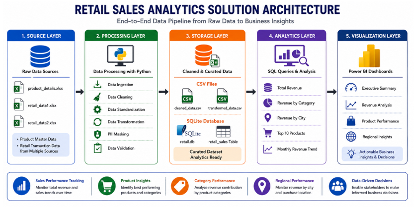

# 🛒 Retail Sales Analytics – Data Engineering Project

_An End-to-End Retail Sales Data Processing and Business Insights Generation Solution using Python, SQL, SQLite, and Power BI._

---

## 📌 Table of Contents

- Overview
- Business Problem
- Dataset Description
- Solution Architecture
- Tools & Technologies
- Project Structure
- Data Engineering Pipeline
- Data Cleaning & Transformation
- Data Validation & Security
- Analytics & KPIs
- Power BI Dashboards
- How to Run This Project
- Key Business Insights
- Author

---

# Overview

Retail organizations generate large volumes of transactional data from multiple sources. Raw datasets often contain missing values, duplicate records, inconsistent formats, and sensitive customer information.

This project builds an end-to-end Retail Sales Analytics solution that:

- Ingests retail sales data from multiple Excel sources
- Cleans and standardizes inconsistent records
- Masks Personally Identifiable Information (PII)
- Generates business-ready analytical datasets
- Stores processed data in SQLite
- Creates business insights using SQL
- Visualizes KPIs through interactive Power BI dashboards

---

# Business Problem

The retail industry requires accurate and reliable data to support business decisions.

This project addresses:

- Poor data quality issues
- Duplicate transaction records
- Inconsistent product and category naming
- Missing values
- Privacy concerns related to customer data
- Lack of centralized reporting

The final solution enables business users to monitor revenue, product performance, customer activity, and regional sales trends.

---

# Dataset Description

The project uses three Excel datasets:

### 1. Product Details Dataset

Contains product master information including:

- Product ID
- Product Name
- Category

### 2. Retail Data 1

Contains:

- Customer Information
- Product Details
- Transaction Details
- Pricing Information
- Payment Methods
- Purchase Locations

### 3. Retail Data 2

Contains similar transaction records collected from another source system with additional inconsistencies and duplicate records.

---

# Solution Architecture



The architecture consists of five layers:

### 1️⃣ Source Layer

Raw Excel Files

- product_details.xlsx
- retail_data1.xlsx
- retail_data2.xlsx

### 2️⃣ Processing Layer

Python & Pandas

- Data Ingestion
- Data Cleaning
- Data Standardization
- Data Transformation
- PII Masking
- Data Validation

### 3️⃣ Storage Layer

Processed Data Storage

- cleaned_data.csv
- transformed_data.csv
- retail.db

### 4️⃣ Analytics Layer

SQL Analysis

- Total Revenue
- Revenue by Category
- Revenue by City
- Top Products
- Monthly Trends

### 5️⃣ Visualization Layer

Power BI Dashboards

- Executive Summary
- Revenue Analysis
- Product Performance
- Regional Insights

---

# Tools & Technologies

### Programming

- Python

### Libraries

- Pandas
- NumPy
- SQLite3

### Database

- SQLite

### Visualization

- Power BI

### Development Environment

- Jupyter Notebook
- VS Code

### Version Control

- Git
- GitHub

---

# Project Structure

```text
Retail-Sales-Analytics/
│
├── README.md
│
├── data/
│   └── USECASE - Data Engineering.xlsx
│
├── Code/
│   ├── Retail_Data_Engineering.ipynb
│   ├── Retail_Data_Engineering.py
│   └── output/
│       ├── cleaned_data.csv
│       ├── transformed_data.csv
│       └── retail.db
│
├── Dashboard/
│   └── PowerBI.pbix
│
├── Document/
│   └── Retail Sales Document.docx
│
└── images/
    └── architecture.png
```

---

# Data Engineering Pipeline

## Data Ingestion

- Read multiple Excel sheets
- Load datasets into Pandas DataFrames
- Consolidate data into a unified dataset

## Data Cleaning

- Handle missing values
- Remove duplicate records
- Correct invalid entries
- Improve data quality

## Data Standardization

Standardized:

- Product Names
- Categories
- Cities
- Payment Methods

Example:

```text
ELEC → Electronics
PHONE → Phone
```

## Data Transformation

Created business-ready fields:

- Revenue
- Month
- Quarter
- Year

Revenue Formula:

```text
Revenue = Price × Quantity × (1 - Discount)
```

## PII Masking

Sensitive information protected:

### Email

```text
johnsmith@gmail.com
↓
jo****@gmail.com
```

### Phone

```text
9876543210
↓
******3210
```

---

# Data Validation & Security

Validation checks performed:

- Price Validation
- Quantity Validation
- Discount Validation
- Duplicate Detection
- Data Integrity Verification

These checks ensure reliable analytical reporting.

---

# Analytics & KPIs

Key metrics generated:

- Total Revenue
- Total Transactions
- Unique Customers
- Average Order Value
- Revenue by Category
- Revenue by City
- Revenue by Product
- Quantity Sold by Product

---

# Power BI Dashboards

### Retail Sales Performance Dashboard

Displays:

- Total Revenue
- Total Transactions
- Unique Customers
- Average Order Value
- Revenue by Category
- Revenue by City

### Revenue Analysis Dashboard

Displays:

- Monthly Revenue Trends
- Revenue by Quarter
- Revenue by Payment Method
- Revenue by Purchase Location

### Product Performance Dashboard

Displays:

- Top Products
- Product Revenue Contribution
- Quantity Sold
- Category Performance

### Regional Insights Dashboard

Displays:

- City-wise Revenue
- Transaction Distribution
- Regional Performance
- Online vs Offline Revenue

---

# Key Business Insights

### Revenue Performance

- Generated 1.23 Billion total revenue
- Processed over 8K transactions
- Served approximately 2K unique customers

### Category Analysis

- Electronics generated the highest revenue
- Electronics recorded the highest quantity sold

### Product Analysis

- Laptop was the top-performing product
- A small number of products contributed a major share of revenue

### Regional Analysis

- Chennai generated the highest revenue
- Revenue distribution remained balanced across major cities

### Sales Trends

- Q3 recorded the highest revenue
- Card payments generated the highest revenue
- Online and offline sales contributed almost equally

---

# How to Run This Project

## Step 1: Clone Repository

```bash
git clone https://github.com/your-username/Retail-Sales-Analytics.git
```

## Step 2: Navigate to Project Folder

```bash
cd Retail-Sales-Analytics
```

## Step 3: Install Required Libraries

```bash
pip install pandas numpy openpyxl
```

## Step 4: Open Jupyter Notebook

```bash
jupyter notebook
```

Open:

```text
Code/Retail_Data_Engineering.ipynb
```

## Step 5: Run the Notebook

Run all cells sequentially.

Outputs generated:

```text
Code/output/cleaned_data.csv

Code/output/transformed_data.csv

Code/output/retail.db
```

## Step 6: Open Power BI Dashboard

Open:

```text
Dashboard/PowerBI.pbix
```

Refresh the dataset if required.

---

# Output Files

| File | Description |
|--------|-------------|
| cleaned_data.csv | Cleaned retail dataset |
| transformed_data.csv | Analytics-ready dataset |
| retail.db | SQLite database |
| PowerBI.pbix | Dashboard report |

---

# Author

### Sahana R

Data Engineering & Analytics Project

Skills Demonstrated:

- Data Engineering
- Python
- Pandas
- SQL
- SQLite
- Power BI
- Data Cleaning
- Data Validation
- Data Visualization

---
⭐ If you found this project useful, consider giving the repository a star.
